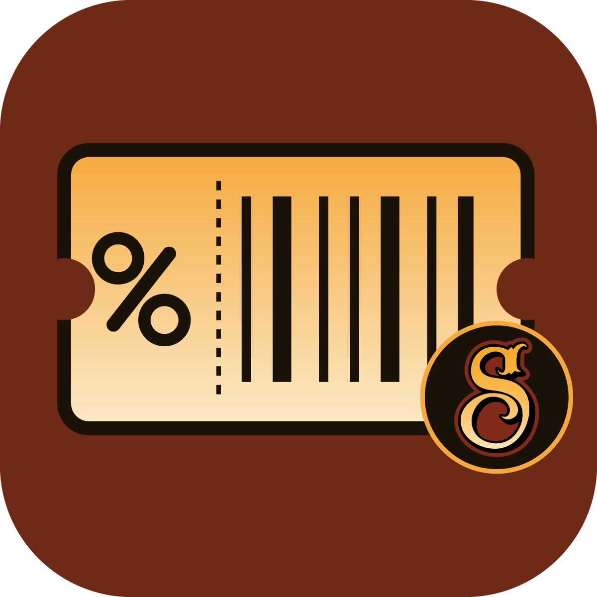

# Discount Code Generator

> This tool is designed to generate and manage discount codes for Shopify stores. It allows you to create new discount codes, top up existing ones, and export them for use in marketing campaigns.

<p align="center">
  
</p>

## Features

- Generate unique discount codes with a specified prefix.
- Top up existing discount codes for multiple Shopify stores.
- Export discount codes to a CSV file for easy integration with marketing platforms like Klaviyo.

## Usage

1. Clone the repository:
   ```bash
   git clone git@github.com:SuavecitoInc/multi-store-discount-code-generator.git
   cd multi-store-discount-code-generator
   ```
2. Install dependencies:
   ```bash
   npm install
   ```
3. Create your Shopify app in the Shopify Dev Dashboard
   - Create App > Start From Dev Dashboard
   - Install the app on all stores you want to generate discount codes for
4. Set up your `config/shopify.json` file with your store handles and collection ids (used for generating discount codes):
   ```json
   {
     "stores": [
       {
         "domain": "store-1",
         "collectionId": "your_store1_collection_id"
       }
     ]
   }
   ```
5. Set up your environment variables in a `.env` file:
   ```env
   CLIENT_ID=your_app_client_id
   CLIENT_SECRET=your_app_client_secret
   ```
6. Run the setup tool to generate the necessary config files (`admin.json` and `discount-config.json`):
   ```bash
   npm run setup
   ```
   If required run this command to stop the config files from being tracked.
   ```bash
   git update-index --skip-worktree config/admin.json config/discounts.json
   ```
7. Run the tool to generate new discount codes:
   ```bash
   npm run create
   ```
8. Run the tool to top up discount codes:
   ```bash
   npm run top-up
   ```
